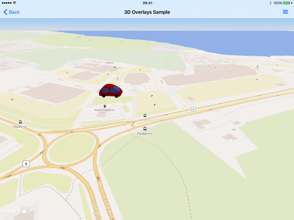

# CARTO Mobile SDK

This is now a maintained fork of original Carto SDK as Carto stopped maintaining it.
If you like the project and want me to keep on maintaining it. Please support it.

CARTO Mobile SDK is an open, multi-platform framework for visualizing maps and providing location based services on mobile devices like smartphones or tablets. It includes high performance and flexible vector tile renderer, multiple built-in routing engines (for both indoor and street maps) plus built-in geocoding and reverse geocoding support.



## Features

* Supports all widespread mobile platforms, including Android, iOS and UWP.
* Supports multiple programming languages, including Objective C, Swift and C# on iOS, Java, Kotlin and C# on Android and C# on UWP.
* Supports common open GIS formats and protocols, including GeoJSON, Mapbox Vector Tiles, MBTiles, TMS.
* High-level vector tile styling language support via [CartoCSS](https://carto.com/developers/styling/cartocss/) for visualizing maps
* Globe and planar map view modes, plus 2.5D tilted map view support
* Routing and geocoding service connectors for both internal and 3rd party services
* Embedded [Valhalla routing engine](https://github.com/valhalla/valhalla) for street level routing
* Embedded [Simple GeoJSON routing engine](https://github.com/nutiteq/python-sgre)  for indoor routing
* Offline package support for maps, routing and geocoding
* Support for connecting to CARTO online services like [Maps API](https://carto.com/developers/maps-api/) and [SQL API](https://carto.com/developers/sql-api/).

## Requirements

* iOS 9 or later on Apple iPhones and iPads, macOS 10.15 or later for Mac Catalyst apps
* Android 3.0 or later on all Android devices
* Windows 10 Mobile or Windows 10 for Windows-based devices

## Installing and building

### Android

```gradle

repositories {
	mavenCentral()
	maven { url 'https://jitpack.io' }
}
dependencies {
	implementation 'com.github.Akylas:mobile-sdk-android-aar:5.0.0'
}
```

### iOS

* In Xcode, go to File > Add Packages....
* Paste the following URL into the search bar: https://github.com/Akylas/mobile-sdk-ios-swift
* Select the version and add it to your project.

You can also download the release from [Releases](https://github.com/Akylas/mobile-sdk/releases)

---

## Standalone Valhalla Routing Library

In addition to the full map SDK, this repository ships a **lightweight standalone routing library** (`routing-lib`) that exposes the Valhalla offline and online routing engine without the full rendering stack.

This is useful when you only need routing in an existing app (navigation, logistics, accessibility) and do not need the map view.

### Features

* Offline routing from Valhalla-format MBTiles databases
* Online routing via any Valhalla HTTP endpoint
* Raw Valhalla JSON results — parse only what you need
* No transitive dependency on CARTO maps renderer
* Kotlin/Swift idiomatic API on Android/iOS

### Android — via JitPack

```gradle
repositories {
    maven { url 'https://jitpack.io' }
}
dependencies {
    // Full map SDK (optional if you only need routing)
    implementation 'com.github.Akylas:mobile-sdk-android-aar:5.0.0'
    // Standalone routing library
    implementation 'com.github.Akylas:mobile-sdk-android-aar:valhalla-routing:5.0.0'
}
```

#### Basic usage (Kotlin)

```kotlin
import com.akylas.routing.ValhallaRoutingService
import com.akylas.routing.ValhallaOnlineRoutingService
import com.akylas.routing.RoutingRequest
import com.akylas.routing.LatLon
import okhttp3.OkHttpClient
import okhttp3.MediaType.Companion.toMediaType
import okhttp3.RequestBody.Companion.toRequestBody

// --- Offline routing (MBTiles) ---
val offlineService = ValhallaRoutingService(listOf("/sdcard/routing/france.vtiles"))
offlineService.profile = "pedestrian"

val request = RoutingRequest(listOf(
    LatLon(48.8566, 2.3522),  // Paris — origin
    LatLon(48.8738, 2.2950)   // Bois de Boulogne — destination
))
val rawJson: String = offlineService.calculateRoute(request)
// Parse rawJson as needed (trip.legs, trip.summary, etc.)

// --- Online routing (Valhalla public API) ---
val httpClient = OkHttpClient()
val onlineService = ValhallaOnlineRoutingService(
    baseURL = "https://valhalla.openstreetmap.de"
) { url, body ->
    val resp = httpClient.newCall(
        okhttp3.Request.Builder()
            .url(url)
            .post(body.toRequestBody("application/json".toMediaType()))
            .build()
    ).execute()
    resp.body!!.string()
}
onlineService.profile = "bicycle"
val routeJson: String = onlineService.calculateRoute(request)
```

### iOS — via Swift Package Manager

In Xcode, go to **File › Add Packages…** and enter:

```
https://github.com/Akylas/mobile-sdk-ios-swift
```

The `ValhallaRouting` library is included as a separate product. Import it in your target:

```swift
import ValhallaRouting

// --- Offline routing (MBTiles) ---
let service = NTValhallaRoutingService(mBTilesPaths: ["/path/to/france.vtiles"])
service?.profile = "pedestrian"

let waypoints = [
    NTLatLon.lat(48.8566, lon: 2.3522),  // Paris — origin
    NTLatLon.lat(48.8738, lon: 2.2950)   // Bois de Boulogne — destination
]
let request = NTRoutingRequest(points: waypoints)

do {
    let rawJson = try service!.calculateRoute(request)
    // Parse rawJson using Codable or any JSON library
    print(rawJson)
} catch {
    print("Routing error:", error)
}

// --- Online routing (URLSession) ---
let online = NTValhallaOnlineRoutingService(
    baseURL: "https://valhalla.openstreetmap.de"
) { url, body, error in
    guard let urlObj = URL(string: url) else { return nil }
    var req = URLRequest(url: urlObj)
    req.httpMethod = "POST"
    req.httpBody = body?.data(using: .utf8)
    req.setValue("application/json", forHTTPHeaderField: "Content-Type")

    var result: String?
    let sem = DispatchSemaphore(value: 0)
    URLSession.shared.dataTask(with: req) { data, _, _ in
        result = data.flatMap { String(data: $0, encoding: .utf8) }
        sem.signal()
    }.resume()
    sem.wait()
    return result
}
online.profile = "bicycle"

let routeJson = try? online.calculateRoute(request)
```

### Routing result

Both online and offline services return **raw Valhalla JSON**. Parse it using your preferred JSON library to extract `trip.summary.length`, `trip.legs[].maneuvers`, etc.

---
## Building

For custom builds, please read the [building guide](./BUILDING.md).

## Documentation and samples

* Developer documentation: https://carto.com/docs/carto-engine/mobile-sdk/
* Android sample app: https://github.com/CartoDB/mobile-android-samples
* iOS sample app: https://github.com/CartoDB/mobile-ios-samples
* .NET (Xamarin and UWP) sample app: https://github.com/CartoDB/mobile-dotnet-samples
* Scripts for preparing offline packages: https://github.com/nutiteq/mobile-sdk-scripts

## Support, Questions?

* Post an [issue](https://github.com/CartoDB/mobile-sdk/issues) to this project, submit a [Pull Request](https://github.com/CartoDB/mobile-sdk/pulls)
* Commercial support options: sales@carto.com

## License

* CARTO Mobile SDK is licensed under the BSD 3-clause "New" or "Revised" License - see the [LICENSE file](LICENSE) for details.

## Developing & Contributing to CARTO

* See [our contributing doc](CONTRIBUTING.md) for how you can improve CARTO, but you will need to sign a Contributor License Agreement (CLA) before making a submission, [learn more here](https://carto.com/contributions).
