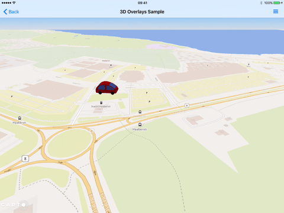

# Massif Maps

**An open, multi-platform map SDK for Android and iOS** — a high-performance vector-tile renderer
with 3D terrain, built-in routing (street and indoor) and geocoding, driven from a single C++ core.

Massif Maps is a maintained fork of the CARTO Mobile SDK, which CARTO stopped maintaining. It was
renamed in 2026 — see the [migration guide](docs/migration.md) for every renamed namespace, package
and style token. If you like the project and want it to keep being maintained, please
[support it](https://massif-maps.github.io/MassifMaps/sponsors).



## 📚 Documentation

Everything is on **https://massif-maps.github.io/MassifMaps/** — and the same pages live in
[`docs/`](docs/) in this repo, so they read on GitHub too.

| | |
|---|---|
| **[Getting started](docs/getting-started/installation.md)** | install the SDK, put a first map on screen |
| **[Guides](docs/guides/)** | the map view, layers & data sources, vector objects, offline maps, routing, geocoding |
| **[Features](docs/features/)** | what this fork adds: 3D terrain, contours, hillshade, composite layers, PMTiles, sky/sun/shadows, post-processing, shields & font icons, live style parameters, GeoJSON tiling, maneuver arrows, MapLibre Tiles |
| **[Internals](docs/internals/index.mdx)** | how it works inside — the [render pipeline](docs/internals/rendering/index.mdx), [binary size & build time](docs/internals/build-and-size.md), the [performance lab notebook](docs/internals/performance-log.md) |
| **[Maintenance](docs/maintenance/index.md)** | upgrading vendored dependencies, regenerating artefacts, platform quirks |
| **[Migration](docs/migration.md)** | moving an app off the CARTO Mobile SDK |
| **[API reference](https://massif-maps.github.io/MassifMaps/api/android/)** | Javadoc (Android) and Jazzy (iOS), generated from the SWIG bindings |

The site is built with Docusaurus from [`website/`](website/) and redeploys on every push to
`master` that touches the docs.

```bash
cd website && npm install
npm start        # dev server + hot reload (also watches ../docs)
npm run build    # what CI runs — the only thing that checks links and builds the search index
```

See [`website/README.md`](website/README.md) for what works in the dev server vs the build, and
[Building the docs](docs/contributing/docs-site.md) for the rest of the pipeline.

## Features

* Supports all widespread mobile platforms, including Android, iOS and UWP.
* Supports multiple programming languages, including Objective C, Swift and C# on iOS, Java, Kotlin and C# on Android and C# on UWP.
* Supports common open GIS formats and protocols, including GeoJSON, Mapbox Vector Tiles, MBTiles, TMS.
* High-level vector tile styling language support via [CartoCSS](https://carto.com/developers/styling/cartocss/) for visualizing maps
* Globe and planar map view modes, plus 2.5D tilted map view support
* Routing and geocoding service connectors for both internal and 3rd party services
* Embedded [Valhalla routing engine](https://github.com/valhalla/valhalla) for street level routing
* Embedded [Simple GeoJSON routing engine](https://github.com/nutiteq/python-sgre)  for indoor routing
* Offline package support for maps, routing and geocoding

### Added by this fork

* [3D terrain](docs/features/3d-terrain.md) from RGB elevation tiles, with depth occlusion and terrain-aware labels
* [On-the-fly contour lines](docs/features/contours.md), [advanced hillshade](docs/features/hillshade.md) and [custom raster shaders](docs/features/custom-raster-shaders.md)
* [Composite vector tile layers](docs/features/composite-vector-tile-layer.md) — external raster/vector sources woven into one CartoCSS style
* [Sun lighting, a shader sky, fog and cascaded shadow maps](docs/features/sky-sun-shadows.md)
* [Sky-anchored objects](docs/features/celestial-objects.md) (sun, moon, stars, aircraft) and a free-roam / look-up camera
* [Full-screen post-processing effects](docs/features/post-processing.md) with access to the terrain depth
* [Shield anchors, SDF font icons, label plates and panorama callout labels](docs/features/label-styling.md)
* [Live style parameters](docs/features/style-parameters.md), including a feature selection that repaints instead of re-decoding
* [GeoJSON tiled through a geojson-vt pyramid](docs/features/geojson-vector-tiles.md), and [navigation maneuver arrows](docs/features/maneuver-arrows.md) built from a route
* [MapLibre Tiles (MLT)](docs/features/maplibre-tiles.md) alongside MVT, in the same decoder and the same styles
* [PMTiles](docs/features/pmtiles.md) (local and HTTP)

## Requirements

* iOS 9 or later on Apple iPhones and iPads, macOS 10.15 or later for Mac Catalyst apps
* Android 3.0 or later on all Android devices
* Windows 10 Mobile or Windows 10 for Windows-based devices

## Installing and building

### Android

```gradle

repositories {
	mavenCentral()
	maven { url 'https://jitpack.io' }
}
dependencies {
	implementation 'com.github.massif-maps:MassifMaps-android-aar:5.0.0'
}
```

### iOS

* In Xcode, go to File > Add Packages....
* Paste the following URL into the search bar: https://github.com/massif-maps/MassifMaps-ios-swift
* Select the version and add it to your project.

You can also download the release from [Releases](https://github.com/massif-maps/MassifMaps/releases)

---

## Standalone Valhalla Routing Library

In addition to the full map SDK, this repository ships a **lightweight standalone routing library** (`routing-lib`) that exposes the Valhalla offline and online routing engine without the full rendering stack.

This is useful when you only need routing in an existing app (navigation, logistics, accessibility) and do not need the map view.

### Features

* Offline routing from Valhalla-format MBTiles databases
* Online routing via any Valhalla HTTP endpoint
* Raw Valhalla JSON results — parse only what you need
* No transitive dependency on the Massif maps renderer
* Kotlin/Swift idiomatic API on Android/iOS

### Android — via JitPack

```gradle
repositories {
    maven { url 'https://jitpack.io' }
}
dependencies {
    // Full map SDK (optional if you only need routing)
    implementation 'com.github.massif-maps:MassifMaps-android-aar:5.0.0'
    // Standalone routing library
    implementation 'com.github.massif-maps:MassifMaps-valhalla-routing:5.0.0'
}
```

#### Basic usage (Kotlin)

```kotlin
import com.massifmaps.valhalla.ValhallaRoutingService
import com.massifmaps.valhalla.ValhallaOnlineRoutingService
import com.massifmaps.valhalla.RoutingRequest
import com.massifmaps.valhalla.LatLon
import okhttp3.OkHttpClient
import okhttp3.MediaType.Companion.toMediaType
import okhttp3.RequestBody.Companion.toRequestBody

// --- Offline routing (MBTiles) ---
val offlineService = ValhallaRoutingService(listOf("/sdcard/routing/france.vtiles"))
offlineService.profile = "pedestrian"

val request = RoutingRequest(listOf(
    LatLon(48.8566, 2.3522),  // Paris — origin
    LatLon(48.8738, 2.2950)   // Bois de Boulogne — destination
))
val rawJson: String = offlineService.calculateRoute(request)
// Parse rawJson as needed (trip.legs, trip.summary, etc.)

// --- Online routing (Valhalla public API) ---
val httpClient = OkHttpClient()
val onlineService = ValhallaOnlineRoutingService(
    baseURL = "https://valhalla.openstreetmap.de"
) { url, body ->
    val resp = httpClient.newCall(
        okhttp3.Request.Builder()
            .url(url)
            .post(body.toRequestBody("application/json".toMediaType()))
            .build()
    ).execute()
    resp.body!!.string()
}
onlineService.profile = "bicycle"
val routeJson: String = onlineService.calculateRoute(request)
```

### iOS — via Swift Package Manager

In Xcode, go to **File › Add Packages…** and enter:

```
https://github.com/massif-maps/MassifMaps-ios-swift
```

The `ValhallaRouting` library is included as a separate product. Import it in your target:

```swift
import ValhallaRouting

// --- Offline routing (MBTiles) ---
let service = MSFValhallaRoutingService(mBTilesPaths: ["/path/to/france.vtiles"])
service?.profile = "pedestrian"

let waypoints = [
    MSFLatLon.lat(48.8566, lon: 2.3522),  // Paris — origin
    MSFLatLon.lat(48.8738, lon: 2.2950)   // Bois de Boulogne — destination
]
let request = MSFRoutingRequest(points: waypoints)

do {
    let rawJson = try service!.calculateRoute(request)
    // Parse rawJson using Codable or any JSON library
    print(rawJson)
} catch {
    print("Routing error:", error)
}

// --- Online routing (URLSession) ---
let online = MSFValhallaOnlineRoutingService(
    baseURL: "https://valhalla.openstreetmap.de"
) { url, body, error in
    guard let urlObj = URL(string: url) else { return nil }
    var req = URLRequest(url: urlObj)
    req.httpMethod = "POST"
    req.httpBody = body?.data(using: .utf8)
    req.setValue("application/json", forHTTPHeaderField: "Content-Type")

    var result: String?
    let sem = DispatchSemaphore(value: 0)
    URLSession.shared.dataTask(with: req) { data, _, _ in
        result = data.flatMap { String(data: $0, encoding: .utf8) }
        sem.signal()
    }.resume()
    sem.wait()
    return result
}
online.profile = "bicycle"

let routeJson = try? online.calculateRoute(request)
```

### Routing result

Both online and offline services return **raw Valhalla JSON**. Parse it using your preferred JSON library to extract `trip.summary.length`, `trip.legs[].maneuvers`, etc.

---
## Building

For custom builds, please read the [building guide](./BUILDING.md).

## Documentation and samples

* Documentation: https://massif-maps.github.io/MassifMaps/
* Demo benches in this repo: `scripts/android-dev` (Android) and `scripts/ios-dev` (iOS)
* Scripts for preparing offline packages: https://github.com/nutiteq/mobile-sdk-scripts

The archived CartoDB sample apps ([android](https://github.com/CartoDB/mobile-android-samples),
[ios](https://github.com/CartoDB/mobile-ios-samples), [dotnet](https://github.com/CartoDB/mobile-dotnet-samples))
still build against the pre-rebrand API; [`docs/migration.md`](docs/migration.md)
lists what to rename.

## Support, Questions?

* Post an [issue](https://github.com/massif-maps/MassifMaps/issues) or a [Pull Request](https://github.com/massif-maps/MassifMaps/pulls)

## License

* Massif Maps is licensed under the BSD 3-clause "New" or "Revised" License - see the [LICENSE file](LICENSE) for details.

## Developing & Contributing

* Start with [CONTRIBUTING.md](CONTRIBUTING.md), then [BUILDING.md](BUILDING.md).
* Before changing the renderer, read [`docs/internals/rendering/`](docs/internals/rendering/index.mdx)
  — it is written so one page covers one subsystem.
* **A change ships with its documentation update in the same commit.** Which page, and the bar for
  each kind of doc, is in [`.claude/CLAUDE.md`](.claude/CLAUDE.md#documentation--every-change-updates-it).
