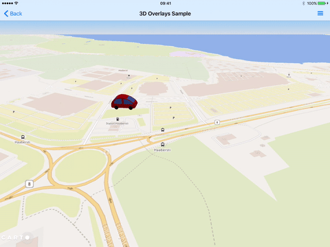

# CARTO Mobile SDK

This is now a maintained fork of original Carto SDK as Carto stopped maintaining it.
If you like the project and want me to keep on maintaining it. Please support it.

CARTO Mobile SDK is an open, multi-platform framework for visualizing maps and providing location based services on mobile devices like smartphones or tablets. It includes high performance and flexible vector tile renderer, multiple built-in routing engines (for both indoor and street maps) plus built-in geocoding and reverse geocoding support.



## Features

* Supports all widespread mobile platforms, including Android, iOS and UWP.
* Supports multiple programming languages, including Objective C, Swift and C# on iOS, Java, Kotlin and C# on Android and C# on UWP.
* Supports common open GIS formats and protocols, including GeoJSON, Mapbox Vector Tiles, MBTiles, TMS.
* High-level vector tile styling language support via [CartoCSS](https://carto.com/developers/styling/cartocss/) for visualizing maps
* Globe and planar map view modes, plus 2.5D tilted map view support
* Routing and geocoding service connectors for both internal and 3rd party services
* Embedded [Valhalla routing engine](https://github.com/valhalla/valhalla) for street level routing
* Embedded [Simple GeoJSON routing engine](https://github.com/nutiteq/python-sgre)  for indoor routing
* Offline package support for maps, routing and geocoding
* Support for connecting to CARTO online services like [Maps API](https://carto.com/developers/maps-api/) and [SQL API](https://carto.com/developers/sql-api/).

## Requirements

* iOS 9 or later on Apple iPhones and iPads, macOS 10.15 or later for Mac Catalyst apps
* Android 3.0 or later on all Android devices
* Windows 10 Mobile or Windows 10 for Windows-based devices

## Installing and building

### Android

```gradle

repositories {
	mavenCentral()
	maven { url 'https://jitpack.io' }
}
dependencies {
	implementation 'com.github.Akylas:mobile-sdk-android-aar:5.0.0'
}
```

### iOS

* In Xcode, go to File > Add Packages....
* Paste the following URL into the search bar: https://github.com/Akylas/mobile-sdk-ios-swift
* Select the version and add it to your project.

You can also download the release from [Releases](https://github.com/Akylas/mobile-sdk/releases)

## Building

For custom builds, please read the [building guide](./BUILDING.md).

## Documentation and samples

* Developer documentation: https://carto.com/docs/carto-engine/mobile-sdk/
* Android sample app: https://github.com/CartoDB/mobile-android-samples
* iOS sample app: https://github.com/CartoDB/mobile-ios-samples
* .NET (Xamarin and UWP) sample app: https://github.com/CartoDB/mobile-dotnet-samples
* Scripts for preparing offline packages: https://github.com/nutiteq/mobile-sdk-scripts

## Support, Questions?

* Post an [issue](https://github.com/CartoDB/mobile-sdk/issues) to this project, submit a [Pull Request](https://github.com/CartoDB/mobile-sdk/pulls)
* Commercial support options: sales@carto.com

## License

* CARTO Mobile SDK is licensed under the BSD 3-clause "New" or "Revised" License - see the [LICENSE file](LICENSE) for details.

## Developing & Contributing to CARTO

* See [our contributing doc](CONTRIBUTING.md) for how you can improve CARTO, but you will need to sign a Contributor License Agreement (CLA) before making a submission, [learn more here](https://carto.com/contributions).
